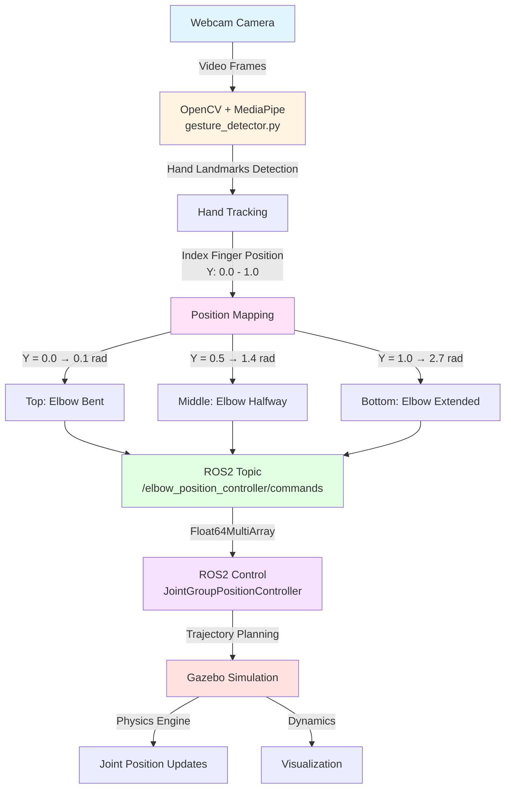

# CV Arm - Gesture Controlled Robot Arm

A ROS2 package that controls a robot arm in Gazebo using hand gestures detected via OpenCV and MediaPipe, or mouse input for testing.

## Features

- **Gesture Control**: Control robot arm with hand gestures using webcam
- **Mouse Control**: Alternative mouse-based control for testing without camera
- **Real-time Tracking**: MediaPipe hand landmark detection with smoothing
- **ROS2 Integration**: Full ros2_control integration with Gazebo
- **Configurable Camera**: Support for USB cameras and IP camera streams

## System Architecture


## Data Flow Details

1. CAPTURE PHASE
   Camera → 640x480 RGB frame @ 30 FPS

2. DETECTION PHASE  
   MediaPipe Hand Detector →
   - 21 hand landmarks in 3D
   - Confidence scores
   - Handedness (left/right)

3. PROCESSING PHASE
   landmark[8] (index finger tip) →
   normalized_y = 1.0 - tip.y  (invert, because y increases downward)
   
4. MAPPING PHASE
   target_angle = joint_min + normalized_y * (joint_max - joint_min)
   0.1 rad ≤ angle ≤ 2.721 rad

5. SMOOTHING PHASE
   current_angle = α * target_angle + (1-α) * current_angle
   (α = 0.3 for smooth motion)

6. PUBLISHING PHASE
   msg.data = [current_angle]
   publisher.publish(msg)

7. CONTROL PHASE
   Controller receives command →
   Plans trajectory →
   Sends to Gazebo

8. SIMULATION PHASE
   Gazebo updates physics →
   Robot arm moves →
   Visual feedback in simulation

## ROS2 Node Graph


## Message Types

### Float64MultiArray
```
std_msgs/Float64MultiArray
├── layout (MultiArrayLayout)
│   ├── dim[] (MultiArrayDimension)
│   └── data_offset (uint32)
└── data[] (float64)
    └── [0]: joint_angle (radians)
```

### JointState
```
sensor_msgs/JointState
├── header (Header)
├── name[] (string)
│   └── ["elbow_joint"]
├── position[] (float64)
│   └── [current_angle]
├── velocity[] (float64)
└── effort[] (float64)
```

### ROS2 Dependencies
- rclpy
- std_msgs
- sensor_msgs
- cv_bridge
- ros_gz_sim
- ros_gz_bridge
- ros_gz_image
- ros2_control

### Custom Camera Source

If ROS is used in a virtual machine or Ubuntu WSL, accesing the inbuild webcamera or usb camers is difficult. The solution is to use a IP camera and connect to it for the recognition part. 

## Nodes

### `gesture_detector`
Detects hand gestures and publishes joint commands.

**Parameters:**
- `camera_source`
  - Integer for USB camera (e.g., 0, 1, 2)
  - String URL for IP camera

**Published Topics:**
- `/elbow_position_controller/commands` (Float64MultiArray)

### `mouse_controller`
Alternative controller using mouse input.

**Published Topics:**
- `/elbow_position_controller/commands` (Float64MultiArray)

## Topics and Services

### Published Topics
- `/elbow_position_controller/commands` - Float64MultiArray
  - Published by gesture_detector or mouse_controller
  - Commands the elbow joint position (in radians)

### Subscribed Topics
- `/joint_states` - sensor_msgs/JointState
  - Current state of all robot joints
  - Published by joint_state_broadcaster

### Controllers
- `elbow_position_controller` - JointGroupPositionController
- `joint_state_broadcaster` - JointStateBroadcaster

